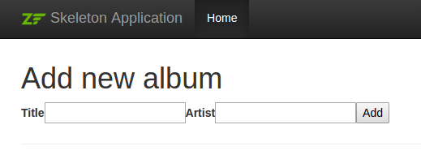

# Forms and actions

## Adding new albums

We can now code up the functionality to add new albums. There are two bits to this part:

- Display a form for user to provide details.
- Process the form submission and store to database.

We will use zend-form to do this. zend-form manages the various form inputs as
well as their validation, the latter of which is handled by the zend-inputfilter
component. We'll start by creating a new class, `Album\Form\AlbumForm`,
extending from `Zend\Form\Form`. Create the file
`module/Album/src/Form/AlbumForm.php` with the following contents:

```php
namespace Album\Form;

use Zend\Form\Form;

class AlbumForm extends Form
{
    public function __construct($name = null)
    {
        // We will ignore the name provided to the constructor
        parent::__construct('album');

        $this->add([
            'name' => 'id',
            'type' => 'hidden',
        ]);
        $this->add([
            'name' => 'title',
            'type' => 'text',
            'options' => [
                'label' => 'Title',
            ],
        ]);
        $this->add([
            'name' => 'artist',
            'type' => 'text',
            'options' => [
                'label' => 'Artist',
            ],
        ]);
        $this->add([
            'name' => 'submit',
            'type' => 'submit',
            'attributes' => [
                'value' => 'Go',
                'id'    => 'submitbutton',
            ],
        ]);
    }
}
```

Within the constructor of `AlbumForm` we do several things. First, we set the
name of the form as we call the parent's constructor. The, we create four form
elements: the id, title, artist, and submit button. For each item we set various
attributes and options, including the label to be displayed.

> ### Form method
>
> HTML forms can be sent using `POST` and `GET`. zend-form defaults to `POST`;
> therefore you don't have to be explicit in setting this option. If you want to
> change it to `GET` however, set the method attribute in the constructor:
>
> ```php
> $this->setAttribute('method', 'GET');
> ```

We also need to set up validation for this form.  [zend-inputfilter](https://zendframework.github.io/zend-inputfilter)
provides a general purpose mechanism for input validation. It also provides an
interface, `InputFilterAwareInterface`, which zend-form will use in order to
bind an input filter to a given form. We'll add this capability now to our
`Album` class.

```php
// module/Album/src/Model/Album.php:
namespace Album\Model;

// Add the following import statements:
use DomainException;
use Zend\Filter\StringTrim;
use Zend\Filter\StripTags;
use Zend\Filter\ToInt;
use Zend\InputFilter\InputFilter;
use Zend\InputFilter\InputFilterAwareInterface;
use Zend\InputFilter\InputFilterInterface;
use Zend\Validator\StringLength;

class Album implements InputFilterAwareInterface
{
    public $id;
    public $artist;
    public $title;

    // Add this property:
    private $inputFilter;

    public function exchangeArray(array $data)
    {
        $this->id     = !empty($data['id']) ? $data['id'] : null;
        $this->artist = !empty($data['artist']) ? $data['artist'] : null;
        $this->title  = !empty($data['title']) ? $data['title'] : null;
    }

    /* Add the following methods: */

    public function setInputFilter(InputFilterInterface $inputFilter)
    {
        throw new DomainException(sprintf(
            '%s does not allow injection of an alternate input filter',
            __CLASS__
        ));
    }

    public function getInputFilter()
    {
        if ($this->inputFilter) {
            return $this->inputFilter;
        }

        $inputFilter = new InputFilter();

        $inputFilter->add([
            'name' => 'id',
            'required' => true,
            'filters' => [
                ['name' => ToInt::class],
            ],
        ]);

        $inputFilter->add([
            'name' => 'artist',
            'required' => true,
            'filters' => [
                ['name' => StripTags::class],
                ['name' => StringTrim::class],
            ],
            'validators' => [
                [
                    'name' => StringLength::class,
                    'options' => [
                        'encoding' => 'UTF-8',
                        'min' => 1,
                        'max' => 100,
                    ],
                ],
            ],
        ]);

        $inputFilter->add([
            'name' => 'title',
            'required' => true,
            'filters' => [
                ['name' => StripTags::class],
                ['name' => StringTrim::class],
            ],
            'validators' => [
                [
                    'name' => StringLength::class,
                    'options' => [
                        'encoding' => 'UTF-8',
                        'min' => 1,
                        'max' => 100,
                    ],
                ],
            ],
        ]);

        $this->inputFilter = $inputFilter;
        return $this->inputFilter;
    }
}
```

The `InputFilterAwareInterface` defines two methods: `setInputFilter()` and
`getInputFilter()`. We only need to implement `getInputFilter()` so we
throw an exception from `setInputFilter()`.

Within `getInputFilter()`, we instantiate an `InputFilter` and then add the
inputs that we require. We add one input for each property that we wish to
filter or validate. For the `id` field we add an `int` filter as we only need
integers. For the text elements, we add two filters, `StripTags` and
`StringTrim`, to remove unwanted HTML and unnecessary white space. We also set
them to be *required* and add a `StringLength` validator to ensure that the user
doesn't enter more characters than we can store into the database.

We now need to get the form to display and then process it on submission. This
is done within the `AlbumController::addAction()`:

```php
// module/Album/src/Controller/AlbumController.php:

// Add the following import statements at the top of the file:
use Album\Form\AlbumForm;
use Album\Model\Album;

class AlbumController extends AbstractActionController
{
    /* ... */

    /* Update the following method to read as follows: */
    public function addAction()
    {
        $form = new AlbumForm();
        $form->get('submit')->setValue('Add');

        $request = $this->getRequest();

        if (! $request->isPost()) {
            return ['form' => $form];
        }

        $album = new Album();
        $form->setInputFilter($album->getInputFilter());
        $form->setData($request->getPost());

        if (! $form->isValid()) {
            return ['form' => $form];
        }

        $album->exchangeArray($form->getData());
        $this->table->saveAlbum($album);
        return $this->redirect()->toRoute('album');
    }

    /* ... */
}
```

After adding the `Album` and `AlbumForm` classes to the import list, we
implement `addAction()`. Let's look at the `addAction()` code in a little more
detail:

```php
$form = new AlbumForm();
$form->get('submit')->setValue('Add');
```

We instantiate `AlbumForm` and set the label on the submit button to "Add". We
do this here as we'll want to re-use the form when editing an album and will use
a different label.

```php
$request = $this->getRequest();

if (! $request->isPost()) {
    return ['form' => $form];
}
```

If the request is not a `POST` request, then no form data has been submitted,
and we need to display the form. zend-mvc allows you to return an array of data
instead of a view model if desired; if you do, the array will be used to create
a view model.

```php
$album = new Album();
$form->setInputFilter($album->getInputFilter());
$form->setData($request->getPost());
```

At this point, we know we have a form submission. We create an `Album` instance,
and pass its input filter on to the form; additionally, we pass the submitted
data from the request instance to the form.

```php
if (! $form->isValid()) {
    return ['form' => $form];
}
```

If form validation fails, we want to redisplay the form. At this point, the form
contains information about what fields failed validation, and why, and this
information will be communicated to the view layer.

```php
$album->exchangeArray($form->getData());
$this->table->saveAlbum($album);
```

If the form is valid, then we grab the data from the form and store to the model
using `saveAlbum()`.

```php
return $this->redirect()->toRoute('album');
```

After we have saved the new album row, we redirect back to the list of albums
using the `Redirect` controller plugin.

We now need to render the form in the `add.phtml` view script:

```php
<?php
// module/Album/view/album/album/add.phtml:

$title = 'Add new album';
$this->headTitle($title);
?>
<h1><?= $this->escapeHtml($title) ?></h1>
<?php
$form->setAttribute('action', $this->url('album', ['action' => 'add']));
$form->prepare();

echo $this->form()->openTag($form);
echo $this->formHidden($form->get('id'));
echo $this->formRow($form->get('title'));
echo $this->formRow($form->get('artist'));
echo $this->formSubmit($form->get('submit'));
echo $this->form()->closeTag();
```

We display a title as before, and then we render the form. zend-form provides
several view helpers to make this a little easier. The `form()` view helper has
an `openTag()` and `closeTag()` method which we use to open and close the form.
Then for each element with a label, we can use `formRow()` to render the label,
input, and any validation error messages; for the two elements that are
standalone and have no validation rules, we use `formHidden()` and
`formSubmit()`.

Alternatively, the process of rendering the form can be simplified by using the
bundled `formCollection` view helper. For example, in the view script above
replace all the form-rendering echo statements with:

```php
echo $this->formCollection($form);
```

This will iterate over the form structure, calling the appropriate label,
element, and error view helpers for each element, but you still have to wrap
`formCollection($form)` with the open and close form tags. This helps reduce the
complexity of your view script in situations where the default HTML rendering of
the form is acceptable.

You should now be able to use the "Add new album" link on the home page of the
application to add a new album record, resulting in something like the
following:



This doesn't look all that great! The reason is because Bootstrap, the CSS
foundation used in the skeleton, has specialized markup for displaying forms! We
can address that in our view script by:

- Adding markup around the elements.
- Rendering labels, elements, and error messages separately.
- Adding attributes to elements.

Update your `add.phtml` view script to read as follows:

```php
<?php
$title = 'Add new album';
$this->headTitle($title);
?>
<h1><?= $this->escapeHtml($title) ?></h1>
<?php
// This provides a default CSS class and placeholder text for the title element:
$album = $form->get('title');
$album->setAttribute('class', 'form-control');
$album->setAttribute('placeholder', 'Album title');

// This provides a default CSS class and placeholder text for the artist element:
$artist = $form->get('artist');
$artist->setAttribute('class', 'form-control');
$artist->setAttribute('placeholder', 'Artist');

// This provides CSS classes for the submit button:
$submit = $form->get('submit');
$submit->setAttribute('class', 'btn btn-primary');

$form->setAttribute('action', $this->url('album', ['action' => 'add']));
$form->prepare();

echo $this->form()->openTag($form);
?>
<?php // Wrap the elements in divs marked as form groups, and render the
      // label, element, and errors separately within ?>
<div class="form-group">
    <?= $this->formLabel($album) ?>
    <?= $this->formElement($album) ?>
    <?= $this->formElementErrors()->render($album, ['class' => 'help-block']) ?>
</div>

<div class="form-group">
    <?= $this->formLabel($artist) ?>
    <?= $this->formElement($artist) ?>
    <?= $this->formElementErrors()->render($artist, ['class' => 'help-block']) ?>
</div>

<?php
echo $this->formSubmit($submit);
echo $this->formHidden($form->get('id'));
echo $this->form()->closeTag();
```

The results we get are much better:


The above is meant to demonstrate both the ease of use of the default form
features, as well as some of the customizations possible when rendering forms.
You should be able to generate any markup necessary for your site.

## Editing an album

Editing an album is almost identical to adding one, so the code is very similar.
This time we use `editAction()` in the `AlbumController`:

```php
// module/Album/src/Controller/AlbumController.php:
// ...

    public function editAction()
    {
        $id = (int) $this->params()->fromRoute('id', 0);

        if (0 === $id) {
            return $this->redirect()->toRoute('album', ['action' => 'add']);
        }

        // Retrieve the album with the specified id. Doing so raises
        // an exception if the album is not found, which should result
        // in redirecting to the landing page.
        try {
            $album = $this->table->getAlbum($id);
        } catch (\Exception $e) {
            return $this->redirect()->toRoute('album', ['action' => 'index']);
        }

        $form = new AlbumForm();
        $form->bind($album);
        $form->get('submit')->setAttribute('value', 'Edit');

        $request = $this->getRequest();
        $viewData = ['id' => $id, 'form' => $form];

        if (! $request->isPost()) {
            return $viewData;
        }

        $form->setInputFilter($album->getInputFilter());
        $form->setData($request->getPost());

        if (! $form->isValid()) {
            return $viewData;
        }

        $this->table->saveAlbum($album);

        // Redirect to album list
        return $this->redirect()->toRoute('album', ['action' => 'index']);
    }
```

This code should look comfortably familiar. Let's look at the differences from
adding an album. Firstly, we look for the `id` that is in the matched route and
use it to load the album to be edited:

```php
$id = (int) $this->params()->fromRoute('id', 0);

if (0 === $id) {
    return $this->redirect()->toRoute('album', ['action' => 'add']);
}

// Retrieve the album with the specified id. Doing so raises
// an exception if the album is not found, which should result
// in redirecting to the landing page.
try {
    $album = $this->table->getAlbum($id);
} catch (\Exception $e) {
    return $this->redirect()->toRoute('album', ['action' => 'index']);
}
```

`params` is a controller plugin that provides a convenient way to retrieve
parameters from the matched route. We use it to retrieve the `id` from the route
we created within the Album module's `module.config.php`. If the `id` is zero,
then we redirect to the add action, otherwise, we continue by getting the album
entity from the database.

We have to check to make sure that the album with the specified `id` can
actually be found. If it cannot, then the data access method throws an
exception. We catch that exception and re-route the user to the index page.

```php
$form = new AlbumForm();
$form->bind($album);
$form->get('submit')->setAttribute('value', 'Edit');
```

The form's `bind()` method attaches the model to the form. This is used in two ways:

- When displaying the form, the initial values for each element are extracted
  from the model.
- After successful validation in `isValid()`, the data from the form is put back
  into the model.

These operations are done using a *hydrator* object. There are a number of
hydrators, but the default one is `Zend\Hydrator\ArraySerializable` which
expects to find two methods in the model: `getArrayCopy()` and
`exchangeArray()`. We have already written `exchangeArray()` in our `Album`
entity, so we now need to write `getArrayCopy()`:

```php
// module/Album/src/Model/Album.php:
// ...

    public function exchangeArray($data)
    {
        $this->id     = isset($data['id']) ? $data['id'] : null;
        $this->artist = isset($data['artist']) ? $data['artist'] : null;
        $this->title  = isset($data['title']) ? $data['title'] : null;
    }

    // Add the following method:
    public function getArrayCopy()
    {
        return [
            'id'     => $this->id,
            'artist' => $this->artist,
            'title'  => $this->title,
        ];
    }

// ...
```

As a result of using `bind()` with its hydrator, we do not need to populate the
form's data back into the `$album` as that's already been done, so we can just
call the mapper's `saveAlbum()` method to store the changes back to the
database.

The view template, `edit.phtml`, looks very similar to the one for adding an album:

```php
<?php
// module/Album/view/album/album/edit.phtml:

$title = 'Edit album';
$this->headTitle($title);
?>
<h1><?= $this->escapeHtml($title) ?></h1>
<?php
$album = $form->get('title');
$album->setAttribute('class', 'form-control');
$album->setAttribute('placeholder', 'Album title');

$artist = $form->get('artist');
$artist->setAttribute('class', 'form-control');
$artist->setAttribute('placeholder', 'Artist');

$submit = $form->get('submit');
$submit->setAttribute('class', 'btn btn-primary');

$form->setAttribute('action', $this->url('album', [
    'action' => 'edit',
    'id'     => $id,
]));
$form->prepare();

echo $this->form()->openTag($form);
?>
<div class="form-group">
    <?= $this->formLabel($album) ?>
    <?= $this->formElement($album) ?>
    <?= $this->formElementErrors()->render($album, ['class' => 'help-block']) ?>
</div>

<div class="form-group">
    <?= $this->formLabel($artist) ?>
    <?= $this->formElement($artist) ?>
    <?= $this->formElementErrors()->render($artist, ['class' => 'help-block']) ?>
</div>

<?php
echo $this->formSubmit($submit);
echo $this->formHidden($form->get('id'));
echo $this->form()->closeTag();
```

The only changes are to use the ‘Edit Album' title and set the form's action to
the 'edit' action too, using the current album identifier.

You should now be able to edit albums.

## Deleting an album

To round out our application, we need to add deletion. We have a "Delete" link
next to each album on our list page, and the naive approach would be to do a
delete when it's clicked. This would be wrong. Remembering our HTTP spec, we
recall that you shouldn't do an irreversible action using GET and should use
POST instead.

We shall show a confirmation form when the user clicks delete, and if they then
click "yes", we will do the deletion. As the form is trivial, we'll code it
directly into our view (zend-form is, after all, optional!).

Let's start with the action code in `AlbumController::deleteAction()`:

```php
// module/Album/src/Album/Controller/AlbumController.php:
//...
    // Add content to the following method:
    public function deleteAction()
    {
        $id = (int) $this->params()->fromRoute('id', 0);
        if (!$id) {
            return $this->redirect()->toRoute('album');
        }

        $request = $this->getRequest();
        if ($request->isPost()) {
            $del = $request->getPost('del', 'No');

            if ($del == 'Yes') {
                $id = (int) $request->getPost('id');
                $this->table->deleteAlbum($id);
            }

            // Redirect to list of albums
            return $this->redirect()->toRoute('album');
        }

        return [
            'id'    => $id,
            'album' => $this->table->getAlbum($id),
        ];
    }
//...
```

As before, we get the `id` from the matched route, and check the request object's `isPost()` to determine whether to show the confirmation page or to delete the album. We use the table object to delete the row using the `deleteAlbum()` method and then redirect back the list of albums. If the request is not a POST, then we retrieve the correct database record and assign to the view, along with the `id`.

The view script is a simple form:

```php
<?php
// module/Album/view/album/album/delete.phtml:

$title = 'Delete album';
$url   = $this->url('album', ['action' => 'delete', 'id' => $id]);

$this->headTitle($title);
?>
<h1><?= $this->escapeHtml($title) ?></h1>

<p>
    Are you sure that you want to delete
    "<?= $this->escapeHtml($album->title) ?>" by
    "<?= $this->escapeHtml($album->artist) ?>"?
</p>

<form action="<?= $url ?>" method="post">
<div class="form-group">
    <input type="hidden" name="id" value="<?= (int) $album->id ?>" />
    <input type="submit" class="btn btn-danger" name="del" value="Yes" />
    <input type="submit" class="btn btn-success" name="del" value="No" />
</div>
</form>
```

In this script, we display a confirmation message to the user and then a form
with "Yes" and "No" buttons. In the action, we checked specifically for the
"Yes" value when doing the deletion.

## Ensuring that the home page displays the list of albums

One final point. At the moment, the home page, `http://zf-tutorial.localhost/`
doesn't display the list of albums.

This is due to a route set up in the `Application` module's `module.config.php`.
To change it, open `module/Application/config/module.config.php` and find the
home route:

```php
'home' => [
    'type' => \Zend\Router\Http\Literal::class,
    'options' => [
        'route'    => '/',
        'defaults' => [
            'controller' => Controller\IndexController::class,
            'action'     => 'index',
        ],
    ],
],
```

Import `Album\Controller\AlbumController` at the top of the file:

```php
use Album\Controller\AlbumController;
```

and change the `controller` from `Controller\IndexController::class` to `AlbumController::class`:

```php
'home' => [
    'type' => \Zend\Router\Http\Literal::class,
    'options' => [
        'route'    => '/',
        'defaults' => [
            'controller' => AlbumController::class, // <-- change here
            'action'     => 'index',
        ],
    ],
],
```

That's it &mdash; you now have a fully working application!
