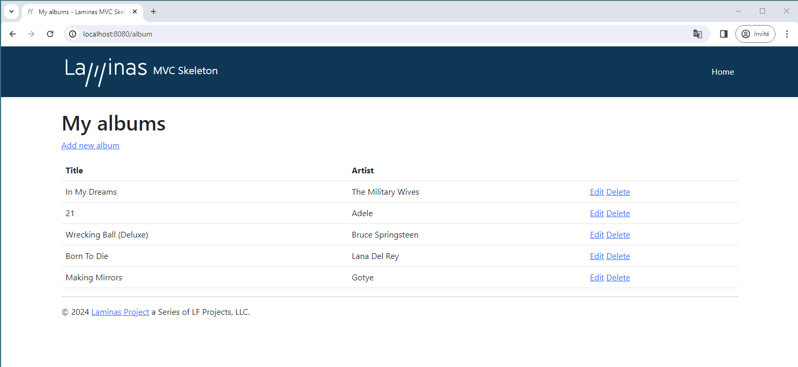

# Database and models

## The database

Now that we have the `Album` module set up with controller action methods and
view scripts, it is time to look at the model section of our application.
Remember that the model is the part that deals with the application's core
purpose (the so-called “business rules”) and, in our case, deals with the
database. We will make use of laminas-db's `Laminas\Db\TableGateway\TableGateway` to
find, insert, update, and delete rows from a database table.

We are going to use Sqlite, via PHP's PDO driver. Create a text file
`data/schema.sql` with the following contents:

```sql
CREATE TABLE album (id INTEGER PRIMARY KEY AUTOINCREMENT, artist varchar(100) NOT NULL, title varchar(100) NOT NULL);
INSERT INTO album (artist, title) VALUES ('The Military Wives', 'In My Dreams');
INSERT INTO album (artist, title) VALUES ('Adele', '21');
INSERT INTO album (artist, title) VALUES ('Bruce Springsteen', 'Wrecking Ball (Deluxe)');
INSERT INTO album (artist, title) VALUES ('Lana Del Rey', 'Born To Die');
INSERT INTO album (artist, title) VALUES ('Gotye', 'Making Mirrors');
```

(The test data chosen happens to be the Bestsellers on Amazon UK at the time of writing!)

Now create the database using the following:

```bash
$ sqlite data/laminastutorial.db < data/schema.sql
```

<!-- markdownlint-disable-next-line MD033-->
<details markdown="1"><summary>Alternative Commands</summary>

### SQLite3

Some systems, including Ubuntu, use the command `sqlite3`; check to see which one to use on your system.

If you use `sqlite3` create the database using the following command:

```bash
$ cat data/schema.sql | sqlite3 data/laminastutorial.db
```

### Using PHP to Create the Database

If you do not have Sqlite installed on your system, you can use PHP to load the database using the same SQL schema file created earlier. Create the file `data/load_db.php` with the following contents:

```php
<?php
$db = new PDO('sqlite:' . realpath(__DIR__) . '/laminastutorial.db');
$fh = fopen(__DIR__ . '/schema.sql', 'r');
while ($line = fread($fh, 4096)) {
    $db->exec($line);
}
fclose($fh);
```

Once created, execute it:

```bash
$ php data/load_db.php
```

</details>
<!-- markdownlint-disable-next-line MD033-->

We now have some data in a database and can write a very simple model for it.

## The model files

Laminas does not provide a laminas-model component because the model is your
business logic, and it's up to you to decide how you want it to work. There are
many components that you can use for this depending on your needs. One approach
is to have model classes represent each entity in your application and then use
mapper objects that load and save entities to the database. Another is to use an
Object-Relational Mapping (ORM) technology, such as Doctrine or Propel.

For this tutorial, we are going to create a model by creating an `AlbumTable`
class that consumes a `Laminas\Db\TableGateway\TableGateway`, and in which each
album will be represented as an `Album` object (known as an *entity*). This is
an implementation of the [Table Data Gateway](http://martinfowler.com/eaaCatalog/tableDataGateway.html)
design pattern to allow for interfacing with data in a database table. Be aware,
though, that the Table Data Gateway pattern can become limiting in larger
systems. There is also a temptation to put database access code into controller
action methods as these are exposed by `Laminas\Db\TableGateway\AbstractTableGateway`.
*Don't do this*!

Let's start by creating a file called `Album.php` under
`module/Album/src/Model`:

```php
namespace Album\Model;

class Album
{
    public $id;
    public $artist;
    public $title;

    public function exchangeArray(array $array): void
    {
        $this->id     = ! empty($array['id']) ? $array['id'] : null;
        $this->artist = ! empty($array['artist']) ? $array['artist'] : null;
        $this->title  = ! empty($array['title']) ? $array['title'] : null;
    }
}
```

Our `Album` entity object is a PHP class. In order to work with laminas-db's
`TableGateway` class, we need to implement the `exchangeArray()` method; this
method copies the data from the provided array to our entity's properties. We
will add an input filter later to ensure the values injected are valid.

Next, we create our `AlbumTable.php` file in `module/Album/src/Model` directory like this:

```php
namespace Album\Model;

use RuntimeException;
use Laminas\Db\TableGateway\TableGatewayInterface;

class AlbumTable
{
    private $tableGateway;

    public function __construct(TableGatewayInterface $tableGateway)
    {
        $this->tableGateway = $tableGateway;
    }

    public function fetchAll()
    {
        return $this->tableGateway->select();
    }

    public function getAlbum($id)
    {
        $id = (int) $id;
        $rowset = $this->tableGateway->select(['id' => $id]);
        $row = $rowset->current();
        if (! $row) {
            throw new RuntimeException(sprintf(
                'Could not find row with identifier %d',
                $id
            ));
        }

        return $row;
    }

    public function saveAlbum(Album $album)
    {
        $data = [
            'artist' => $album->artist,
            'title'  => $album->title,
        ];

        $id = (int) $album->id;

        if ($id === 0) {
            $this->tableGateway->insert($data);
            return;
        }

        try {
            $this->getAlbum($id);
        } catch (RuntimeException $e) {
            throw new RuntimeException(sprintf(
                'Cannot update album with identifier %d; does not exist',
                $id
            ));
        }

        $this->tableGateway->update($data, ['id' => $id]);
    }

    public function deleteAlbum($id)
    {
        $this->tableGateway->delete(['id' => (int) $id]);
    }
}

```

There's a lot going on here. Firstly, we set the protected property
`$tableGateway` to the `TableGateway` instance passed in the constructor,
hinting against the `TableGatewayInterface` (which allows us to provide
alternate implementations easily, including mock instances during testing). We
will use this to perform operations on the database table for our albums.

We then create some helper methods that our application will use to interface
with the table gateway. `fetchAll()` retrieves all albums rows from the database
as a `ResultSet`, `getAlbum()` retrieves a single row as an `Album` object,
`saveAlbum()` either creates a new row in the database or updates a row that
already exists, and `deleteAlbum()` removes the row completely. The code for each
of these methods is, hopefully, self-explanatory.

## Using ServiceManager to configure the table gateway and inject into the AlbumTable

In order to always use the same instance of our `AlbumTable`, we will use the
`ServiceManager` to define how to create one. 
This is most easily done by adding a `ServiceManager` configuration to the `module.config.php` 
which is automatically loaded by the `ModuleManager` and applied to the `ServiceManager`.
We'll then be able to retrieve the `AlbumTable` when we need it.

To configure the `ServiceManager`, we can either supply the name of the class to
be instantiated and a factory (closure, callback, or class name of a factory
class) that instantiates the object when the `ServiceManager` needs it. 

Add a `service_manager` configuration to `module/Album/config/module.config.php`:

<!-- markdownlint-disable MD033 -->
<pre class="language-php" data-line="3,38-41"><code>
namespace Album;

use Album\Model\AlbumTableFactory;
use Laminas\Router\Http\Segment;
use Laminas\ServiceManager\Factory\InvokableFactory;

return [
    'controllers' => [
        'factories' => [
            Controller\AlbumController::class => InvokableFactory::class,
        ],
    ],

    // The following section is new and should be added to your file:
    'router' => [
        'routes' => [
            'album' => [
                'type'    => Segment::class,
                'options' => [
                    'route' => '/album[/:action[/:id]]',
                    'constraints' => [
                        'action' => '[a-zA-Z][a-zA-Z0-9_-]*',
                        'id'     => '[0-9]+',
                    ],
                    'defaults' => [
                        'controller' => Controller\AlbumController::class,
                        'action'     => 'index',
                    ],
                ],
            ],
        ],
    ],
    'view_manager' => [
        'template_path_stack' => [
            'album' => __DIR__ . '/../view',
        ],
    ],
    'service_manager' => [
        'factories' => [
            Model\AlbumTable::class => AlbumTableFactory::class,
        ],

    ],
];
</code></pre>
<!-- markdownlint-enable MD033 -->

This method returns an array of `factories` that are all merged together by the
`ModuleManager` before passing them to the `ServiceManager`. When requesting the `ServiceManager` 
to create `Album\Model\AlbumTable`, the `ServiceManager` will invoke the `AlbumTableFactory` class, which we need to create next.

Let's create the `AlbumTableFactory.php` factory in `module/Album/src/Model`:

````php
namespace Album\Model;

use Laminas\Db\Adapter\AdapterInterface;
use Laminas\Db\ResultSet\ResultSet;
use Laminas\Db\TableGateway\TableGateway;
use Laminas\ServiceManager\Factory\FactoryInterface;
use Psr\Container\ContainerInterface;

class AlbumTableFactory implements FactoryInterface
{

    public function __invoke(ContainerInterface $container, $requestedName, ?array $options = null): AlbumTable
    {
        $dbAdapter = $container->get(AdapterInterface::class);
        $resultSetPrototype = new ResultSet();
        $resultSetPrototype->setArrayObjectPrototype(new Album());
        $tableGateway = new TableGateway('album', $dbAdapter, null, $resultSetPrototype); 
        return new AlbumTable($tableGateway);
    }
}
````

The `AlbumTableFactory` factory uses the `ServiceManager` to fetch a `Laminas\Db\Adapter\AdapterInterface`
implementation (also from the `ServiceManager`) and use it to create a
`TableGateway` object. The `TableGateway` is told to use an `Album` object
whenever it creates a new result row. The `TableGateway` classes use the
prototype pattern for creation of result sets and entities. This means that
instead of instantiating when required, the system clones a previously
instantiated object. Then, finally, the factory creates a `AlbumTable` object passing it the `TableGateway` object.
See
[PHP Constructor Best Practices and the Prototype Pattern](https://dbglory.wordpress.com/2012/03/10/php-constructor-best-practices-and-the-prototype-pattern/)
for more details.

> ### Factories
>
> The above demonstrates building factories as a *class* and mapping the
> class factory in your module configuration. Another option would have been to use a closure that contains
> the same code a the `AlbumTableFactory`. Using a class for the factory has a number of benefits:
>
> - The code is not parsed or executed unless the factory is invoked.
> - You can easily unit test the factory to ensure it does what it should.
> - You can extend the factory if desired.
> - You can re-use the factory across multiple instances that have related
>   construction.
>
> Creating factories is covered in the [laminas-servicemanager documentation](https://docs.laminas.dev/laminas-servicemanager/configuring-the-service-manager/#factories).

The `Laminas\Db\Adapter\AdapterInterface` service is registered by the laminas-db
component.  You may have noticed earlier that `config/modules.config.php`
contains the following entries:

```php
return [
    'Laminas\Form',
    'Laminas\Db',
    'Laminas\Router',
    'Laminas\Validator',
    /* ... */
],
```

All Laminas components that provide laminas-servicemanager configuration are
also exposed as modules themselves; the prompts as to where to register the
components during our initial installation occurred to ensure that the above
entries are created for you.

The end result is that we can already rely on having a factory for the
`Laminas\Db\Adapter\AdapterInterface` service; now we need to provide configuration
so it can create an adapter for us.

Laminas's `ModuleManager` merges all the configuration from each module's
`module.config.php` file, and then merges in the files in `config/autoload/`
(first `*.global.php` files, and then `*.local.php` files). We'll add our
database configuration information to `global.php`, which you should commit to
your version control system. You can use `local.php` (outside of the VCS) to
store the credentials for your database if you want to. Modify
`config/autoload/global.php` (in the project root, not inside the `Album`
module) with following code:

<!-- markdownlint-disable MD033 -->
<pre class="language-php" data-line="2-5"><code>
return [
    'db' => [
        'driver' => 'Pdo',
        'dsn'    => sprintf('sqlite:%s/data/laminastutorial.db', realpath(getcwd())),
    ],
];
</code></pre>
<!-- markdownlint-enable MD033 -->

If you were configuring a database that required credentials, you would put the
general configuration in your `config/autoload/global.php`, and then the
configuration for the current environment, including the DSN and credentials, in
the `config/autoload/local.php` file. These get merged when the application
runs, ensuring you have a full definition, but allows you to keep files with
credentials outside of version control.

## Back to the controller

Now that we have a model, we need to inject it into our controller so we can use
it.

Firstly, we'll add a constructor to our controller. Open the file
`module/Album/src/Controller/AlbumController.php` and add the following property
and constructor:

<!-- markdownlint-disable MD033 -->
<pre class="language-php" data-line="3-4,10-17"><code>
namespace Album\Controller;

// Add the following import:
use Album\Model\AlbumTable;
use Laminas\Mvc\Controller\AbstractActionController;
use Laminas\View\Model\ViewModel;

class AlbumController extends AbstractActionController
{
    // Add this property:
    private $table;

    // Add this constructor:
    public function __construct(AlbumTable $table)
    {
        $this->table = $table;
    }

    /* ... */
}
</code></pre>
<!-- markdownlint-enable MD033 -->

Our controller now depends on `AlbumTable`, so we will need to create a factory
for the controller that will inject the `AlbumTable`.

Let's create the `AlbumControllerFactory.php` in `module/Album/src/Controller`:

````php
namespace Album\Controller;

use Album\Model\AlbumTable;
use Laminas\ServiceManager\Factory\FactoryInterface;
use Psr\Container\ContainerInterface;

class AlbumControllerFactory implements FactoryInterface
{

    /**
     * @inheritDoc
     */
    public function __invoke(ContainerInterface $container, $requestedName, ?array $options = null): AlbumController
    {
        return new AlbumController(
            $container->get(AlbumTable::class)
        );
    }
}
````

Then we can modify the `controllers` section of the `module.config.php` to use the new factory:

<!-- markdownlint-disable MD033 -->
<pre class="language-php" data-line="3,10"><code>
namespace Album;

use Album\Controller\AlbumControllerFactory;
use Album\Model\AlbumTableFactory;
use Laminas\Router\Http\Segment;

return [
    'controllers' => [
        'factories' => [
            Controller\AlbumController::class => AlbumControllerFactory::class
        ],
    ],

    // the rest of the code
];

</code></pre>

We can now access the property `$table` from within our controller whenever we
need to interact with our model.

## Listing albums

In order to list the albums, we need to retrieve them from the model and pass
them to the view. To do this, we fill in `indexAction()` within
`AlbumController`. Update the `AlbumController::indexAction()` as follows:

<!-- markdownlint-disable MD033 -->
<pre class="language-php" data-line="5-7"><code>
// module/Album/src/Controller/AlbumController.php:
// ...
    public function indexAction()
    {
        return new ViewModel([
            'albums' => $this->table->fetchAll(),
        ]);
    }
// ...
</code></pre>
<!-- markdownlint-enable MD033 -->

With Laminas, in order to set variables in the view, we return a
`ViewModel` instance where the first parameter of the constructor is an array
containing data we wish to represent. These are then automatically passed to the
view script. The `ViewModel` object also allows us to change the view script
that is used, but the default is to use `{module name}/{controller name}/{action
name}`. We can now fill in the `index.phtml` view script:

```php
<?php
// module/Album/view/album/album/index.phtml:

$title = 'My albums';
$this->headTitle($title);
?>
<h1><?= $this->escapeHtml($title) ?></h1>
<p>
    <a href="<?= $this->url('album', ['action' => 'add']) ?>">Add new album</a>
</p>

<table class="table">
<tr>
    <th>Title</th>
    <th>Artist</th>
    <th>&nbsp;</th>
</tr>
<?php foreach ($albums as $album) : ?>
    <tr>
        <td><?= $this->escapeHtml($album->title) ?></td>
        <td><?= $this->escapeHtml($album->artist) ?></td>
        <td>
            <a href="<?= $this->url('album', ['action' => 'edit', 'id' => $album->id]) ?>">Edit</a>
            <a href="<?= $this->url('album', ['action' => 'delete', 'id' => $album->id]) ?>">Delete</a>
        </td>
    </tr>
<?php endforeach; ?>
</table>
```

The first thing we do is to set the title for the page (used in the layout) and
also set the title for the `<head>` section using the `headTitle()` view helper
which will display in the browser's title bar. We then create a link to add a
new album.

The `url()` view helper is provided by laminas-mvc and laminas-view, and is used to create
the links we need. The first parameter to `url()` is the route name we wish to
use for construction of the URL, and the second parameter is an array of
variables to substitute into route placeholders. In this case we use our `album`
route which is set up to accept two placeholder variables: `action` and `id`.

We iterate over the `$albums` that we assigned from the controller action.
laminas-view automatically ensures that these variables are extracted into the
scope of the view script; you may also access them using `$this->{variable
name}` in order to differentiate between variables provided to the view script
and those created inside it.

We then create a table to display each album's title and artist, and provide
links to allow for editing and deleting the record. A standard `foreach:` loop
is used to iterate over the list of albums, and we use the alternate form using
a colon and `endforeach;` as it is easier to scan than to try and match up
braces. Again, the `url()` view helper is used to create the edit and delete
links.

> ### Escaping
>
> We always use the `escapeHtml()` view helper to help protect ourselves from
> [Cross Site Scripting (XSS) vulnerabilities](http://en.wikipedia.org/wiki/Cross-site_scripting).

If you open `http://localhost:8080/album` (or `http://laminas-mvc-tutorial.localhost/album` 
if you are using self-hosted Apache) you should see this:


