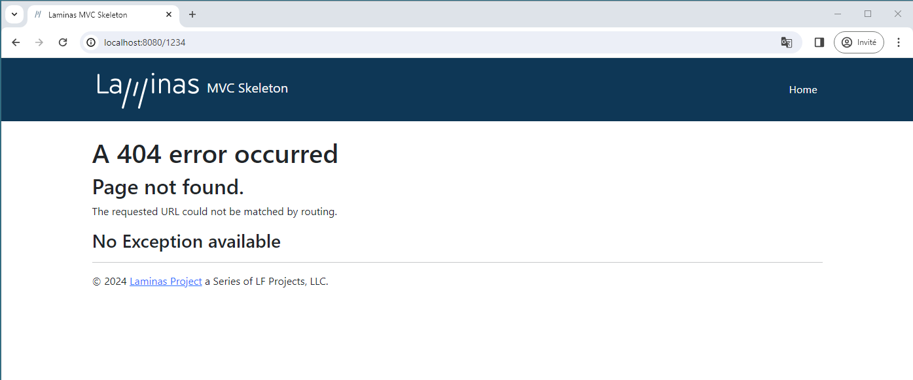

# Getting started: A skeleton application

In order to build our application, we need to have at least PHP 7.3. We will start with the
[Laminas MVC Skeleton Application](https://github.com/laminas/laminas-mvc-skeleton)
available on [GitHub](https://github.com/). Use [Composer](https://getcomposer.org)
to create a new project from scratch:

```bash
$ composer create-project -s dev laminas/laminas-mvc-skeleton path/to/install
```

This will install an initial set of dependencies, including:

- laminas-component-installer, which helps automate injection of component
  configuration into your application.
- laminas-mvc, the kernel for MVC applications.

The default is to provide the minimum amount of dependencies necessary to run a
laminas-mvc application. However, you may have additional needs that you know at
the outset, and, as such, the skeleton also ships with an installer plugin that
will prompt you for a number of items.

First, it will prompt:

```text
    Do you want a minimal install (no optional packages)? Y/n
```

> ### Prompts and default values
>
> All prompts emitted by the installer provide the list of options available,
> and will specify the default option via a capital letter. Default values are
> used if the user presses "Enter" with no value. In the previous example, "Y"
> is the default.

If you answer "Y", or press enter with no selection, the installer will not
raise any additional prompts, and finish installing your application. If you
answer "n", it will continue prompting you:

```text
    Would you like to install the developer toolbar? y/N
```

The [developer toolbar](https://github.com/laminas/laminas-developer-tools)
provides an in-browser toolbar with timing and profiling information, and can be
useful when debugging an application. For the purposes of the tutorial, however,
we will not be using it; hit either "Enter", or "n" followed by "Enter".

```text
    Would you like to install caching support? y/N
```

We will not be demonstrating caching in this tutorial, so either hit "Enter", or
"n" followed by "Enter".

```text
    Would you like to install database support (installs laminas-db)? y/N
```

We *will* be using laminas-db extensively in this tutorial, so hit "y" followed by
"Enter". You should see the following text appear:

```text
    Will install laminas/laminas-db (^2.8.1)
    When prompted to install as a module, select application.config.php or modules.config.php
```

The next prompt is:

```text
    Would you like to install forms support (installs laminas-form)? y/N
```

This tutorial also uses laminas-form, so we will again select "y" to install this;
doing so emits a similar message to that used for laminas-db.

At this point, we can answer "n" to the remaining features:

```text
    Would you like to install JSON de/serialization support? y/N
    Would you like to install logging support? y/N
    Would you like to install MVC-based console support? (We recommend migrating to symfony/console, or Aura.CLI) y/N
    Would you like to install i18n support? y/N
    Would you like to install the official MVC plugins, including PRG support, identity, and flash messages? y/N
    Would you like to use the PSR-7 middleware dispatcher? y/N
    Would you like to install sessions support? y/N
    Would you like to install MVC testing support? y/N
    Would you like to install the laminas-di integration for laminas-servicemanager? y/N
```

At a certain point, you'll see the following text:

```text
Updating root package
    Running an update to install optional packages

...

Updating application configuration...

  Please select which config file you wish to inject 'Laminas\Db' into:
  [0] Do not inject
  [1] config/modules.config.php
  Make your selection (default is 0):
```

We want to enable the various selections we made in the application. As such,
we'll choose `1`, which will then give us the following prompt:

```text
  Remember this option for other packages of the same type? (y/N)
```

In our case, we can safely say "y", which will mean we will no longer be
prompted for additional packages. (The only package in the default set of
prompts that you may not want to enable by default is `Laminas\Test`.)

Once the installation is done, the skeleton installer removes itself, and the
new application is ready to start!

> ### Downloading the skeleton
>
> Another way to install the Laminas MVC Skeleton Application is to use github to
> download a compressed archive. Go to
> https://github.com/laminas/laminas-mvc-skeleton, click the "Clone or
> download" button, and select "Download ZIP". This will download a file with a
> name like `laminas-mvc-skeleton-master.zip` or similar.
>
> Unzip this file into the directory where you keep all your vhosts and rename
> the resultant directory to `laminas-mvc-tutorial`.
>
> laminas-mvc-skeleton is set up to use [Composer](https://getcomposer.org)
> to resolve its dependencies. Run the following from within your new
> laminas-mvc-tutorial folder to install them:
>
> ```bash
> $ composer self-update
> $ composer install
> ```
>
> This takes a while. You should see output like the following:
>
> ```text
> Installing dependencies from lock file
> - Installing laminas/laminas-component-installer (2.1.2)
>
> ...
>
> Generating autoload files
> ```
>
> At this point, you will be prompted to answer questions as noted above.
>
> Alternately, if you do not have Composer installed, but *do* have docker-compose available, you can run Composer via those:
>
> ```bash
> $ docker-compose build
> $ docker-compose run laminas composer install
> ```

> ### Timeouts
>
> If you see this message:
>
> ```text
> [RuntimeException]
>   The process timed out.
> ```
>
> then your connection was too slow to download the entire package in time, and
> composer timed out. To avoid this, instead of running:
>
> ```bash
> $ composer install
> ```
>
> run instead:
>
> ```bash
> $ COMPOSER_PROCESS_TIMEOUT=5000 composer install
> ```

> ### Windows users using WAMP
>
> For windows users with wamp:
>
> #### 1. Install Composer for Windows
>
> Check Composer is properly installed by running:
>
> ```bash
> $ composer
> ```
>
> Otherwise follow the
> [installation guide for Composer](https://getcomposer.org/doc/00-intro.md#installation-windows).
>
> #### 2. Install Git for Windows
>
>
> Check Git is properly installed by running:
>
> ```bash
> $ git
> ```
>
> Otherwise follow the
> [installation guide for GitHub Desktop](https://desktop.github.com/).
>
> #### 3. Now install the Skeleton using
>
> ```bash
> $ composer create-project -s dev laminas/laminas-mvc-skeleton path/to/install
> ```

We can now move on to the web server setup.

## Web Servers

In this tutorial, we will step you through four different ways to setup your web
server:

- Via the PHP built-in web server.
- Via docker-compose.
- Using Apache.

### Using the Built-in PHP web Server

You can use PHP's built-in web server when developing your application. To do
this, start the server from the project's root directory:

```bash
$ php -S 0.0.0.0:8080 -t public public/index.php
```

This will make the website available on port 8080 on all network interfaces,
using `public/index.php` to handle routing. This means the site is accessible
via `http://localhost:8080` or `http://<your-local-IP>:8080`.

If you’ve done it right, you should see the following.


To test that your routing is working, navigate to `http://localhost:8080/1234`,
and you should see the following 404 page:



> ### Development only
>
> PHP's built-in web server should be used **for development only**.

### Using docker-compose

[Docker](https://www.docker.com/) containers wrap a piece of software and everything needed to run it,
guaranteeing consistent operation regardless of the host environment; it is an
alternative to virtual machines, as it runs as a layer on top of the host
environment.

[docker-compose](https://docs.docker.com/compose/) is a tool for automating
configuration of containers and composing dependencies between them, such as
volume storage, networking, etc.

The skeleton application ships with a `Dockerfile` and configuration for
docker-compose; we recommend using docker-compose, as it provides a foundation
for mapping additional containers you might need as part of your application,
including a database server, cache servers, and more. To build and start the
image, use:

```bash
$ docker-compose up -d --build
```

After the first build, you can truncate this to:

```bash
$ docker-compose up -d
```

Once built, you can also run commands on the container. The docker-compose
configuration initially only defines one container, with the environment name
"laminas"; use that to execute commands, such as updating dependencies via composer:

```bash
$ docker-compose run laminas composer update
```

The configuration includes both PHP 7.3 and Apache 2.4, and maps the host port
8080 to port 80 of the container.

### Using the Apache Web Server

We will not cover installing [Apache](https://httpd.apache.org), and will assume
you already have it installed. We recommend installing Apache 2.4, and will only
cover configuration for that version.

You now need to create an Apache virtual host for the application and edit your
hosts file so that `http://laminas-mvc-tutorial.localhost` will serve `index.php` from
the `laminas-mvc-tutorial/public/` directory.

Setting up the virtual host is usually done within `httpd.conf` or
`extra/httpd-vhosts.conf`. If you are using `httpd-vhosts.conf`, ensure that
this file is included by your main `httpd.conf` file. Some Linux distributions
(ex: Ubuntu) package Apache so that configuration files are stored in
`/etc/apache2` and create one file per virtual host inside folder
`/etc/apache2/sites-enabled`. In this case, you would place the virtual host
block below into the file `/etc/apache2/sites-enabled/laminas-mvc-tutorial`.

Ensure that `NameVirtualHost` is defined and set to `*:80` or similar, and then
define a virtual host along these lines:

```apache
<VirtualHost *:80>
    ServerName laminas-mvc-tutorial.localhost
    DocumentRoot /path/to/laminas-mvc-tutorial/public
    SetEnv APPLICATION_ENV "development"
    <Directory /path/to/laminas-mvc-tutorial/public>
        DirectoryIndex index.php
        AllowOverride All
        Require all granted
    </Directory>
</VirtualHost>
```

Make sure that you update your `/etc/hosts` or
`c:\windows\system32\drivers\etc\hosts` file so that `laminas-mvc-tutorial.localhost` is
mapped to `127.0.0.1`. The website can then be accessed using
`http://laminas-mvc-tutorial.localhost`.

```none
127.0.0.1 laminas-mvc-tutorial.localhost localhost
```

Restart Apache.

If you've done so correctly, you will get the same results as covered under
[the PHP built-in web server](#using-the-built-in-php-web-server).

To test that your `.htaccess` file is working, navigate to
`http://laminas-mvc-tutorial.localhost/1234`, and you should see the 404 page as noted
earlier.  If you see a standard Apache 404 error, then you need to fix your
`.htaccess` usage before continuing.

If you're are using IIS with the URL Rewrite Module, import the following:

```apache
RewriteCond %{REQUEST_FILENAME} !-f
RewriteRule ^ index.php [NC,L]
```

You now have a working skeleton application and we can start adding the specifics for our application.

## Error reporting

Optionally, *when using Apache*, you can use the `APPLICATION_ENV` setting in
your `VirtualHost` to let PHP output all its errors to the browser. This can be
useful during the development of your application.

Edit `laminas-mvc-tutorial/public/index.php` directory and change it to the following:

```php
use Laminas\Mvc\Application;
use Laminas\Stdlib\ArrayUtils;

/**
 * Display all errors when APPLICATION_ENV is development.
 */
if ($_SERVER['APPLICATION_ENV'] === 'development') {
    error_reporting(E_ALL);
    ini_set("display_errors", '1');
}

/**
 * This makes our life easier when dealing with paths. Everything is relative
 * to the application root now.
 */
chdir(dirname(__DIR__));

// Decline static file requests back to the PHP built-in webserver
if (php_sapi_name() === 'cli-server') {
    $path = realpath(__DIR__ . parse_url($_SERVER['REQUEST_URI'], PHP_URL_PATH));
    if (__FILE__ !== $path && is_file($path)) {
        return false;
    }
    unset($path);
}

// Composer autoloading
include __DIR__ . '/../vendor/autoload.php';

if (! class_exists(Application::class)) {
    throw new RuntimeException(
        "Unable to load application.\n"
        . "- Type `composer install` if you are developing locally.\n"
        . "- Type `docker-compose run laminas composer install` if you are using Docker.\n"
    );
}

// Retrieve configuration
$appConfig = require __DIR__ . '/../config/application.config.php';
if (file_exists(__DIR__ . '/../config/development.config.php')) {
    $appConfig = ArrayUtils::merge($appConfig, require __DIR__ . '/../config/development.config.php');
}

// Run the application!
Application::init($appConfig)->run();
```

## Development mode

Before we begin, we're going to enable *development mode* for the application.
The skeleton application provides two files that allow us to specify general
development settings we want to use everywhere; these may include enabling
modules for debugging, or enabling error display in our view scripts. These
files are located at:

- `config/development.config.php.dist`
- `config/autoload/development.local.php.dist`

When we enable development mode, these files are copied to:

- `config/development.config.php`
- `config/autoload/development.local.php`

This allows them to be merged into our application. When we disable development
mode, these two files that were created are then removed, leaving only the
`.dist` versions. (The repository also contains rules to ignore the copies.)

Let's enable development mode now:

```bash
$ composer development-enable
```

> ### Never enable development mode in production
>
> You should never enable development mode in production, as the typical
> reason to enable it is to enable debugging! As noted, the artifacts generated
> by enabling development mode cannot be committed to your repository, so
> assuming you don't run the command in production, you should be safe.
>
> You can test the status of development mode using:
>
> ```bash
> $ composer development-status
> ```
>
> And you can disable it using:
>
> ```bash
> $ composer development-disable
> ```
